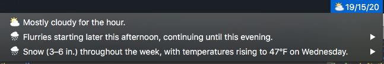
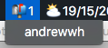

- [Weather](#markdown-header-grid)
- [Gmail](#markdown-header-gmail)
- [Grid](#markdown-header-grid)

# Weather


weather.lua is a simple interface for pulling back weather information. The main functions are `weather.weather(apiKey, callback)` and `weather.getIcon(iconCode)`. The former call the callback and pass in a weather hash. The latter receives an icon code and returns an icon.

The expected file format for forecast_io_api_key.lua is:

``` lua
return 'asdf123'
```

# Gmail


gmail.lua allows you to get the new message count in an inbox. Just call `gmail.mailCount('username', 'password', callback)`. The callback function will be called with the number of new messages.

The expected file format for gmail_creds.lua is:

``` lua
return {{
    username = 'user1',
    password = 'password1'
  },{
    username = 'user2',
    password = 'password2'
}}
```

# Grid
A 2x2 grid system that I like to use.
